## 一、准备工作
申请一个Github账号
安装Node.js
选择LTS版本。

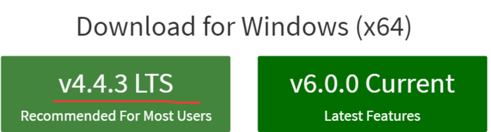

安装Git或者Github
这里主要是为了安装Git，选择跟你系统匹配的版本即可。如果你不知道Git是什么东西，请安装Github，然后自己再去了解一下。
安装 Hexo
任意目录执行如下命令即可：
> npm install -g hexo

## 二、搭建初始博客主页
### 1. 建立你的博客仓库
仓库主要用来存放你的博客相关的数据。先到你的Github主页找到New repository按钮点击建立新仓库。然后按照，下图所示填写仓库名字，一定要和你的申请Github账户时的填的名字一致，其他的默认即可。最后点击下方的创建按钮即可。之后你部署更新博客内容时，就会提交文件到这个仓库。

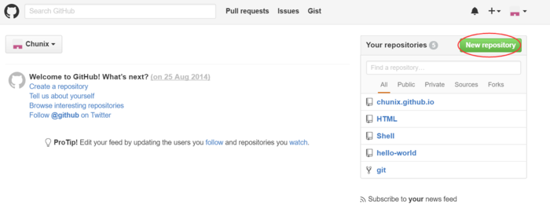
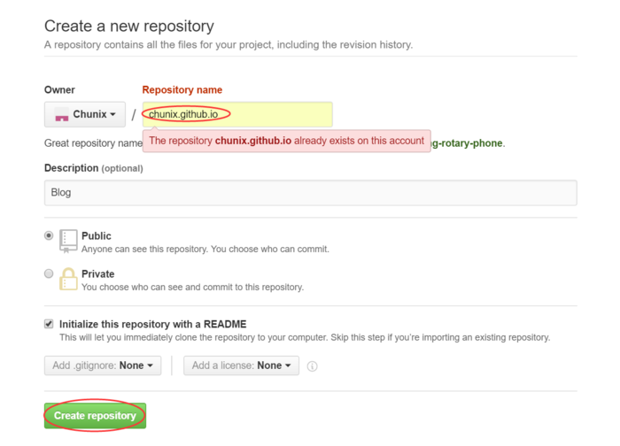

### 2. 创建本地博客
调用下面命令初始化一个本地博客，该命令会在当前文件夹下生成一个yourname.github.io的文件夹。

> hexo init chunix.github.io

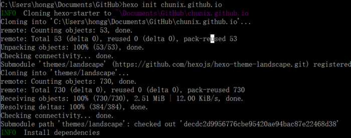

### 3. 本地博客调试
新建一篇名为"Hello Hexo"的文章

> hexo new "Hello Hexo"

文件将产生在/source/_posts/这个目录下，你可以打开编辑其内容。也可以不使用这个命令，直接将你要发布的文章的Markdown文件放到这个目录即可。

产生博客网页需要的文件

> hexo g

比如可以将Markdown文章转换为相应的HTML文件，其中g也可以用generate。

启用本地服务器调试

> hexo s

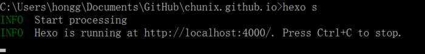

然后你就可以在浏览器输入localhost:4000来查看你的网页设置，如下：

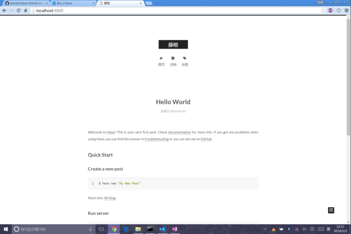

### 4. 部署到你的Github仓库
要部署本地的配置到你的远程仓库需要做两件事：

首先需要安装部署工具，在你前面初始化的文件夹下执行如下命令即可。

> npm install hexo-deployer-git --save

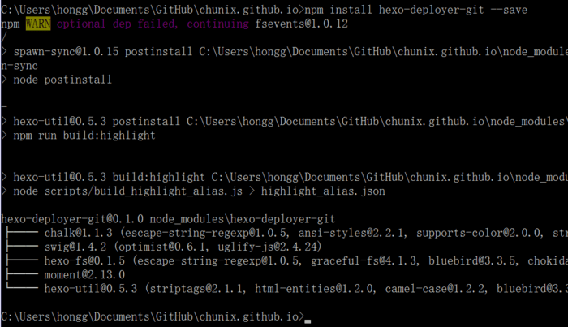

更改_config.yml配置你Github仓库的信息
```
# Deployment
## Docs: https://hexo.io/docs/deployment.html
deploy:
    type: git
    repo: https://github.com/chunix/chunix.github.io.git
    branch: master
```
做完以上两部，你就可以调用hexo deploy（简写命令hexo d）命令实施部署了。

> hexo d

命令成功执行完，你就可以通过https://yourname.github.io访问你的博客主页，像我的这个：藤榕

提醒：执行hexo d的时候，你的主页不能处于打开状态，也就是说，如果你一边开着你的博客主页，一边执行命令，就会失败。

## 三、完善你的博客主页
第二步成功之后，你会发现，这还只是Hexo的官方示例主页。怎么把它变成自己想要的样子呢？我们继续往下走。

### 1. 声明拥有者
在_config.yml里找到如下字段，更改为你喜欢的名字。其中zh-Hans代表语言是简体中文。

```
# Site
title: 藤榕
subtitle:
description: 提笔为字，落笔生芽。
author: 字芽
language: zh-Hans
timezone:
```

### 2. 更换主题
感觉默认的主题不好看，那就换个主题。以next主题为例：

克隆主题代码
>git clone https://github.com/iissnan/hexo-theme-next themes/next

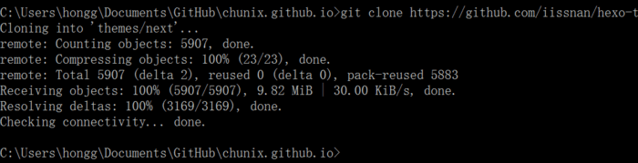

更换主题
在_config.yml里找到如下字段，更改为你刚刚下载的主题名字。

```
# Extensions
## Plugins: https://hexo.io/plugins/
## Themes: https://hexo.io/themes/
theme: next
```

### 3. 配置主题
首先说明一下，有关主题的配置都在theme/next/_config.yml中修改，不要和yourname.github.io/_config.yml文件搞混。

菜单显示调整
在theme/next文件夹下_config.yml里找到menu字段,不想显示在主页就用#注释掉，调换上下顺序可以调整菜单的显示顺序。
```
menu:
    home: /
    categories: /categories
    tags: /tags
    archives: /archives
    about: /about
    #commonweal: /404.html
```

配置菜单内容
即使开启了菜单之后，并没有实际内容，点击相应的选项会返回空白页。这个时候我们要自己手动添加这几个页面。很简单，在yourname.github.io目录下使用下面三条命令可以分别生成分类、标签和关于三个页面的Markdown文件，分别在yourname.github.io/source/下三个对应的文件夹中。
```
>hexo new page "categories"
>hexo new page "tags"
>hexo new page "about"
```
接着我们做如下修改：
在source/categories/index.md和source/tags/index.md分别添加对应的type项。如下是：categories/index.md的改动。

```
title: categories
date: 2016-05-04 13:50:14
type: "categories"
```
另外还要在你的文章中加入分类和标签信息，如下是该文章的标签和分类信息。
```
    ---
    title: 来，我们搭建个自己的博客主页
    date: 2016-05-04 20:44:49
    tags:
     - Hexo
     - Blog
    categories: 
     - Bye World
    ---
---
```
在`source/about/index.md`则直接添加你想要提供的关于博客或者你自己的内容即可，比如我的：
```
    ---
    title: about
    date: 2016-05-04 13:24:34
    ---
    <center></center>
    ### 作者：
    **字芽**
    ### 座右铭：
    **失败只有一种，就是半途而废。**
```
其中，我把图片放在了source/images/下面。显示效果如下：

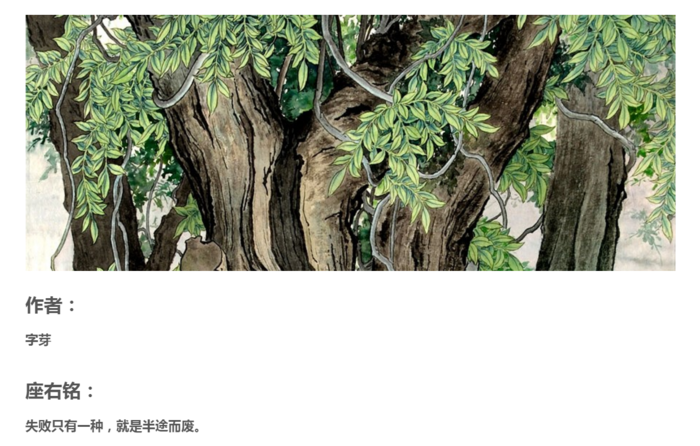

作者头像
其中头像图片avatar.jpg放在theme/next/source/images。
```
    # Sidebar Avatar
    # in theme directory(source/images): /images/avatar.jpg
    # in site  directory(source/uploads): /uploads/avatar.jpg
    avatar: /images/avatar.jpg
```
阅读全文链接
```
    # Automatically Excerpt. Not recommand.
    # Please use <!-- more --> in the post to control excerpt accurately.
    auto_excerpt:
      enable: true
      length: 150
```
去掉文章目录中的多余编号
下面的number默认是true，会导致像我这样已经给文章各模块加了编号的人有双重编号的问题，我们需要设置为false。
```
# Table Of Contents in the Sidebar
toc:
  enable: true

  # Automatically add list number to toc.
  number: false
```
Next主题三种风格切换
```
# Schemes
#scheme: Muse
scheme: Mist
#scheme: Pisces
```
### 4. 打开打赏功能
首先准备一张你支付宝账户的二维码截图，命名为alipay.png放到theme/next/source/images。然后在theme/next/_config.yml文件中添加如下字段：
```
# Donate 打赏
alipay: /images/alipay.png
```
打开打赏功能之后就可以在每篇文章最后看到打赏的按钮了。

### 5. 添加多说评论支持
注册多说账号（支持微博，QQ等直接登陆）；

注册完之后，在首页点击我要安装按钮,出现如下界面，按照你的站点填写：

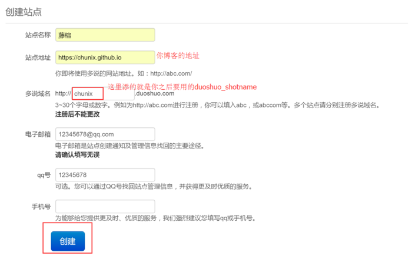

创建完站点之后，到如下为止，把你的多说user_id记录下来，之后要用。

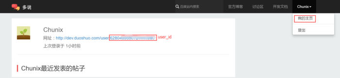

更改theme/next/_config.yml如下字段：
```
# Duoshuo ShortName
    duoshuo_shortname: chunix
# Share
    duoshuo_share: true
duoshuo_info:
    ua_enable: true
    admin_enable: true
    user_id: 6280************
    #admin_nickname: Author
```
当admin_enable是true时，必须填写user_id。这个打开跟不打开的区别好像是是否显示评论用户的软件信息，如下图所示：

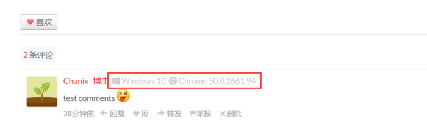

## 四、最后
强烈建议大家每次做好一个改动都要先本地看看有没有生效，先hexo g，再hexo s即可。最后确认改动都OK，再使用hexo d部署到Github仓库。还要感谢《Windows下搭建免费个人博客》的作者qingfeng825，我就是看了这篇文章才有了自己搭建博客的兴趣。其实整个搭建过程真的是依葫芦画瓢，非常简单，只是更多的乐趣和知识还等着我们探索。最后，祝大家玩的开心。